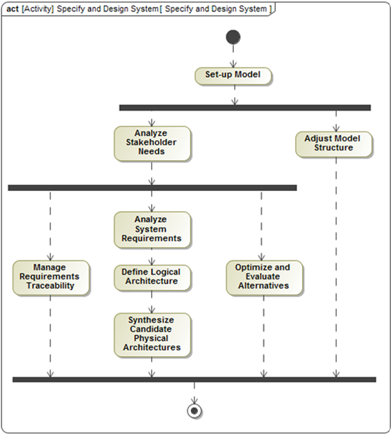

# Automated Appointment System
## About
Project for EN.645.631.82, an Introduction to Model Based Systems Engineering at Johns Hopkins University. Artifacts for the design of an Automated Appointment System.

## License
Distributed under the Apache License 2.0. See `LICENSE.txt` for more information.

## Methodology
Development followed the Object Oriented Systems Engineering Method (OOSEM) with iterative refinement on each activity. OOSEM was tailored to meet our project objectives and contraints. This tailored version of OOSEM  involves 9 basic activities:

1. **Set Up Model:** Establish the models organization. It lays out the modeling convention and standards, ensures consistent representation and style across the model.
1. **Analyze Stakeholder Needs:** An activity to identify stakeholders and their needs. This includes understanding the stakeholders' goals, objectives, and constraints.
1. **Analyze System Requirements:** Specifies the system requirements in terms of its input and output responses and other black box characteristics. This includes identifying functional requirements as well as other constraints.
1. **Define Logical Architecture:** The third step is to define the logical architecture of the system. This development activity decomposes the system into logical parts and defines how they interact. It provides a solution-agnostic view into the problem space.
1. **Synthesize Candidate Physical Architectures:** Allocates the logical parts to physical parts. Defines how the physical parts interact. It provides a ‘solution’ view (i.e. depicts the ‘solution space’).
1. **Manage Requirements Traveability:** This activity helps us track the flow of requirements from their source to their implementation and verification. It is a key part of systems engineering and helps to ensure that the system meets the needs of the stakeholders.
1. **Optimize and Evaluate Alternatives:** Performs engineering analysis that supports system design trade studies and design optimization. Invoked throughout the design process.
1. **Adjust Model Structure:** Natural adjusts to the layout of the system model to account for the logical organization of new system artifacts.

  

## Release Content
* In the `model` directory.
  * System Model of the Automated Appointment System, `.mdzip` file available to import into cameo with addtional `.mdzip.bak` backup file.
      * `Automated Appointment System (AAS) Model.mdzip`
      * `Automated Appointment System (AAS) Model.mdzip.bak`

* In the `resources` directory
  * Methodology utilized for systems engineering development
    * `Tailored_OOSEM.png`
    
* The Cameo model report for the Automated Appointment System
  * `Final Project Report.pptx`
  

