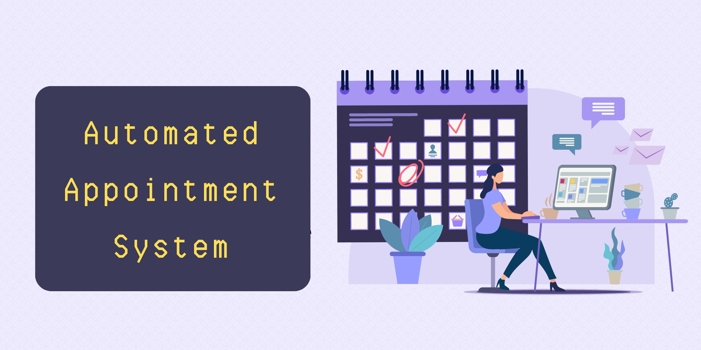

# Automated Appointment System

<br />
<p align="center">
  <a href="https://github.com/jgome284/Automated-Appointment-System">
    
  </a>

  <h3 align="center">Foreword</h3>

  <p align="center">
    System design documents and React webapp prototype for an Automated Appointment System.
    <br />
    <a href="https://github.com/jgome284/Automated-Appointment-System/issues">Report Bug</a>
    ·
    <a href="https://github.com/jgome284/Automated-Appointment-System/issues">Request Feature</a>
  </p>
</p>

## Table of Contents

- [Automated Appointment System](#automated-appointment-system)
  - [Table of Contents](#table-of-contents)
  - [About](#about)
    - [Design Methodology](#design-methodology)
    - [Webapp Development](#webapp-development)
    - [Release Content](#release-content)
  - [Setup](#setup)
  - [Prerequisites](#prerequisites)
    - [Docker](#docker)
    - [Visual Studio Code](#visual-studio-code)
  - [Getting started](#getting-started)
  - [License](#license)

## About

This project contains artifacts for the design of an Automated Appointment System and a webapp prototype. System design deliverables were completed for EN.645.631.82, an Introduction to Model Based Systems Engineering at Johns Hopkins University. The webapp was created with [React](https://react.dev/) to demo an early prototype. It can captures new users and creates appointments from the created user list.

### Design Methodology

Conceptual design followed the Object Oriented Systems Engineering Method (OOSEM) with iterative refinement on each activity. OOSEM was tailored to meet our project objectives and contraints. This tailored version of OOSEM involves 9 basic activities:

1. **Set Up Model:** Establish the models organization. It lays out the modeling convention and standards, ensures consistent representation and style across the model.
1. **Analyze Stakeholder Needs:** An activity to identify stakeholders and their needs. This includes understanding the stakeholders' goals, objectives, and constraints.
1. **Analyze System Requirements:** Specifies the system requirements in terms of its input and output responses and other black box characteristics. This includes identifying functional requirements as well as other constraints.
1. **Define Logical Architecture:** The third step is to define the logical architecture of the system. This development activity decomposes the system into logical parts and defines how they interact. It provides a solution-agnostic view into the problem space.
1. **Synthesize Candidate Physical Architectures:** Allocates the logical parts to physical parts. Defines how the physical parts interact. It provides a ‘solution’ view (i.e. depicts the ‘solution space’).
1. **Manage Requirements Traveability:** This activity helps us track the flow of requirements from their source to their implementation and verification. It is a key part of systems engineering and helps to ensure that the system meets the needs of the stakeholders.
1. **Optimize and Evaluate Alternatives:** Performs engineering analysis that supports system design trade studies and design optimization. Invoked throughout the design process.
1. **Adjust Model Structure:** Natural adjusts to the layout of the system model to account for the logical organization of new system artifacts.

<p align="center">
  
</p>

### Webapp Development

Development for [the webapp](./appt-planner/) leveraged React to create a front-end. It provides input to capture new users and handling for new appointments from the created user list. [React](https://react.dev/) is a widely adopted JavaScript framework that is used to build user interfaces. With React, we create reusable components that rerender when changes for them are captured by the Virtual DOM.

### Release Content

- In the [`model`](./model/) directory.
  - System Model of the Automated Appointment System, `.mdzip` file available to import into cameo with an additional `.mdzip.bak` backup file.
    - `Automated Appointment System (AAS) Model.mdzip`
    - `Automated Appointment System (AAS) Model.mdzip.bak`

- The Cameo model report for the Automated Appointment System
  - `Final Project Report.pptx`

- In the [`appt-planner`](./appt-planner/) directory.
  - A react application bootstrapped with [Create React App](https://github.com/facebook/create-react-app).

## Setup

This project includes a Dev Container for the webapp to use on Visual Studio Code. It serves as a full-featured development environment with everything needed to run Node. Dev Containers separate tools, libraries, or runtimes needed for working with a codebase. They aid in continuous integration and testing. Dev containers can be run locally or remotely, in a private or public cloud, in a variety of supporting tools and editors.

[This DevContainer](.devcontainer) is built IAW the [DevContainers specification](https://containers.dev/implementors/spec/) and tailored for a development environment that runs on Debian GNU/Linux 12 (bookworm). JavaScript dependencies are versioned in accordance with [`package-lock.json`](./appt-planner/package-lock.json) and project configurations are detailed in [`package.json`](./appt-planner/package.json). The devcontainer also has git for version control and several extensions installed for Visual Studio Code as IDE utilities.

<!-- PREREQUISITES -->
## Prerequisites

### Docker

To start the webapp, you need to have Docker Engine and Docker Compose on your machine. You can either:

- Install [Docker Desktop](https://www.docker.com/products/docker-desktop/) which includes both Docker Engine and Docker Compose. (Recommended ⭐)
- Install [Docker Engine](https://docs.docker.com/engine/install/binaries/) and [Docker Compose](https://docs.docker.com/compose/install/standalone/) as standalone binaries. (If it suits your fancy 🤵)

### Visual Studio Code

This devcontainer is setup for development on Visual Studio Code. You should have it installed along with the [remote development pack](https://marketplace.visualstudio.com/items?itemName=ms-vscode-remote.vscode-remote-extensionpack) to enable the IDE's DevContainers functionality.

<!-- GETTING STARTED -->
## Getting started

To start, open VS Code in a directory of your choice. With the terminal, clone this repository via `git clone https://github.com/jgome284/Automated-Appointment-System`.

Open Docker Desktop to run the Docker daemon, a background process that manages and coordinates Docker containers on your system. On VS Code, open your local copy of the project and start the development container by running `Dev Containers: Rebuild and Reopen In Container` in the command palette. It can be accessed with the keyboard shortcut `ctrl + shift + P` on your keyboard.

When the Dev Container launches, `cd` to the [`appt-planner`](./appt-planner/) directory and install project dependencies via npm by executing the following command. If successful, a `node_modules` folder should appear in your directory.

```sh
npm install
```

Our `package.json` has many useful scripts aliased via npm. To run the development version of the webapp run the following command.

```sh
npm start
```

If you make changes you can package a new production build of the application via the following command. If successful, you should see updated files in the [`build`](./appt-planner/build/) folder for the webapp.

```sh
npm run build
```

You can deploy the production build of the webapp on your local machine via the `serve` command detailed below. Then, open the webapp on [localhost:3000](http://localhost:3000) ... Now create new users and add some appointments, yay! ( ﾉ ﾟｰﾟ)ﾉ!

```sh
serve -s appt-planner/build
```

## License

Distributed under the Apache License 2.0. See `LICENSE` for more information.
